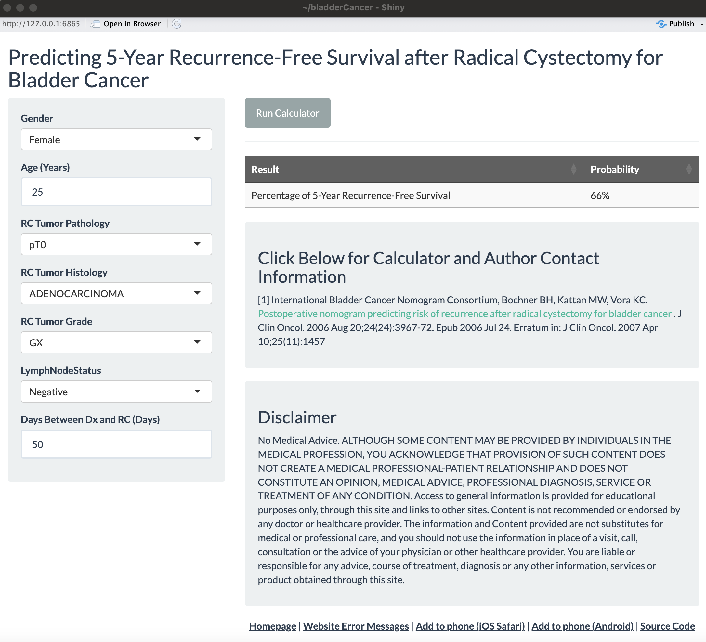

<!-- README.md is generated from README.Rmd. Please edit that file -->

```{r, include = FALSE}
knitr::opts_chunk$set(
  collapse = TRUE,
  comment = "#>",
  fig.path = "man/figures/README-",
  out.width = "100%"
)
```

# riskcalc <a href="https://clevelandclinicqhs.github.io/riskcalc/"></a>

<!-- badges: start -->
[](https://github.com/ClevelandClinicQHS/riskcalc/actions/workflows/test-coverage.yaml)
[](https://github.com/ClevelandClinicQHS/riskcalc/actions/workflows/R-CMD-check.yaml)
[](https://CRAN.R-project.org/package=riskcalc)

[](https://lifecycle.r-lib.org/articles/stages.html#experimental)
<!-- badges: end -->

The goal of `riskcalc` is to accelerate building [`shiny`](https://www.rstudio.com/products/shiny/)-based risk calculators for https://riskcalc.org/. It enables you to export an executable application template into a directory containing the pre-populated `R` scripts to run your app using the standard formatting. You can get a blank template to start from scratch, or provide model objects to the call to populate inputs/outputs for you. From there, you can make the necessary tweaks to complete your application.

## Installation

You can install the development version of `riskcalc` from [GitHub](https://github.com/) with:

``` r
# install.packages("devtools")
devtools::install_github("ClevelandClinicQHS/riskcalc")
```
# Examples

Here we'll go through a couple examples. First, load the package.

```{r}
# Load the package
library(riskcalc) 
```

## Blank app

The `risk_calulator` function by default will export a blank application template to your working directory with a default name. You can optionally specify the location to place the app, as well as its name.

```{r, eval = FALSE}
risk_calculator(
  app_directory = "/PATH_TO_FOLDER",
  app_name = "BlankRiskCalculator"
)
```

Execution of the above code will create a new directory in `/PATH_TO_FOLDER/BlankRiskCalculator` with the following contents:

* `global.R`: Objects to load/execute when the app is launched
* `ui.R`: Default interface to the application
* `server.R`: App server with dormant functionality (though the code templates are present)

In RStudio, we can then open (one of) these files and click `Run App`, as it is a functioning `shiny` application. It looks like this:


It provides the default app themes and information panels, as well as creates the necessary source code link for when the `R` code gets pushed to the [website's GitHub repository](https://github.com/ClevelandClinicQHS/riskcalc-website). The `ui.R` and `server.R` files have various placeholders for you to go in and add titles, variable inputs, etc., as needed.

## Model populated app

You can also provide a `glm` or `coxph` object to the `risk_calculator` function call to get the scripts for a functioning risk calculator with all of the inputs and prediction calculation setup for you, along with other arguments for various formatting preferences. We'll go through an example of a creating an application that mimics the appearance and functionality of the [bladder cancer app](https://riskcalc.org/bladderCancer/):

```{r, eval = FALSE}

# Load packages
library(riskcalc) 
library(survival)

# Build the model
mod <- 
  coxph(
    formula = Surv(Time, Recurrence) ~ .,
    data = bladderCancer
  )

mod |>
  
  # Build the risk calculator
  risk_calculator(
    time = 5, # Produce 5-year survival probabilities
    app_directory = "/PATH_TO_FOLDER",
    app_name = "bladderCancer",
    title = "Predicting 5-Year Recurrence-Free Survival after Radical Cystectomy for Bladder Cancer",
    citation = 
      htmltools::HTML("<p>[1] International Bladder Cancer Nomogram Consortium, Bochner BH, Kattan MW, Vora KC.
      <a href = 'http://jco.ascopubs.org/content/24/24/3967.full.pdf'> Postoperative nomogram predicting risk of recurrence after radical cystectomy for bladder cancer</a>
      . J Clin Oncol. 2006 Aug 20;24(24):3967-72. Epub 2006 Jul 24. Erratum in: J Clin Oncol. 2007 Apr 10;25(11):1457</p>"),
    label = "Percentage of 5-Year Recurrence-Free Survival",
    value_header = "Probability",
    format = function(x) paste0(round(100 * x), "%"),
    labels =
      c(
        Age = "Age (Years)",
        RCTumorPathology = "RC Tumor Pathology",
        RCTumorHistology = "RC Tumor Histology",
        RCTumorGrade = "RC Tumor Grade",
        LymphNodeStatus = "LymphNodeStatus",
        DaysBetweenDXRC = "Days Between Dx and RC (Days)"
      ),
    levels = 
      list(
        Gender = 
          c(
            M = "Male",
            `F` = "Female"
          )
      ),
    placeholders = c(Age = "20-100")
  )
```

This creates a new directory in `/PATH_TO_FOLDER/bladderCancer` with the following contents:

* `global.R`: Objects to load/execute when the app is launched, including loading the `coxph` model object, the function to generate the prediction, the time point of interest, and the function for formatting the final result in the table.
* `ui.R`: Interface to the application including the title, predictor inputs (with formatted labels), citation information, etc.
* `server.R`: Application server that validates inputs, creates the input data frame from the current selections, and produces the result output table.
* `model.RData`: The `coxph` object that was passed to the function call, used for generating predictions.

In RStudio, we can then open (one of) these `.R` files and click `Run App`, as it is a functioning `shiny` application. It looks like this after the inputs are entered and the "Run Calculator" button is pressed:



Some notes on select arguments:

* `app_name`: We use short-hand names for applications in their URL at [riskcalc.org](https://riskcalc.org/) (e.g., https://riskcalc.org/bladderCancer/). The source code for applications were [added](https://github.com/ClevelandClinicQHS/riskcalc-website) to our [QHS GitHub](https://github.com/clevelandclinicqhs) page. Part of that was to add source code links back to GitHub within the apps themselves. So when this argument is used, it will automatically add the source code link to the assumed spot that it would be on GitHub (see bottom-right of screenshot above).
* `citation`: This is where applications typically display the source publication for the risk calculator. It could just be a simple character string, but in this case, HTML code was supplied to add text that contains a hyperlink to the publication.
* `format`: This is a transformation that can be applied to the default result value for preferred display. For a `coxph` object, by default, the _survival_ probability (which is what we want) is computed at the specified `time` point (in this case, 5-years), but we added some rounding and tacked on a `%` symbol. For a `glm` object, the default output is the predicted value where `type = "response"` (see `?predict.glm`)
* `placeholders`: Adds restrictions for what values can be entered into the numeric predictor inputs. It adds the background text so the user can see the range, but it also enforces this restriction with the [`shiny::validate`](https://shiny.posit.co/r/reference/shiny/0.11/validate.html) function.
